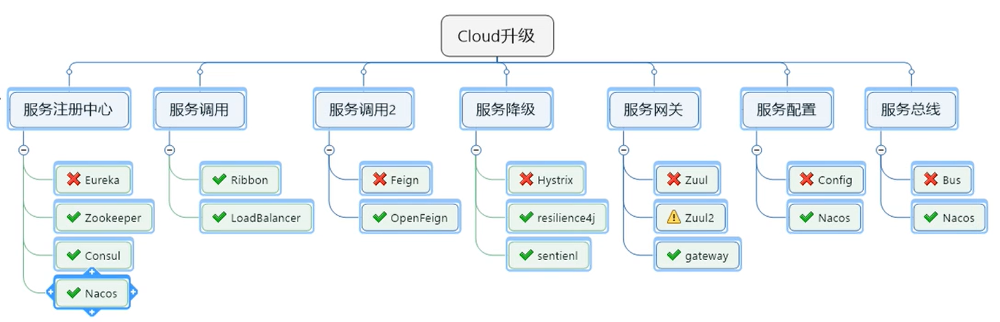
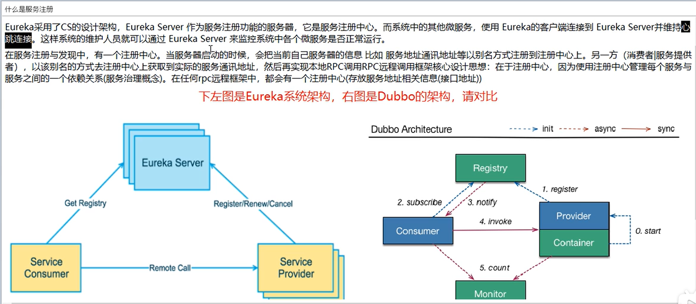
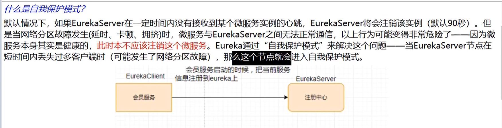
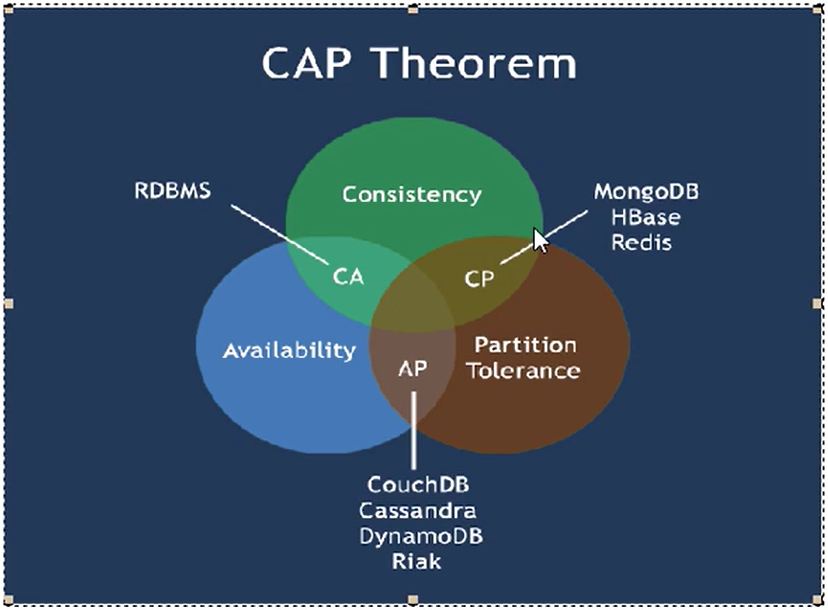
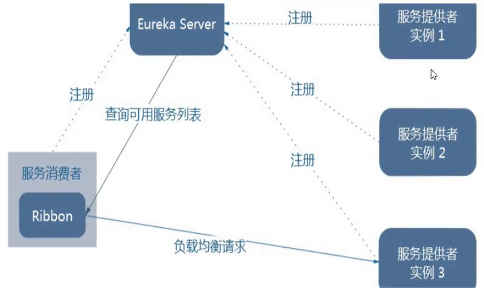
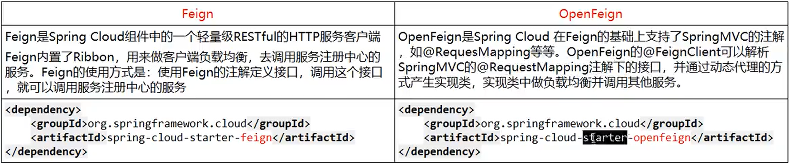
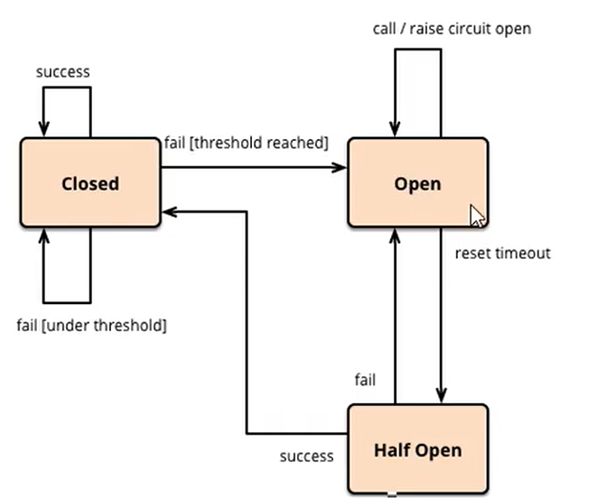
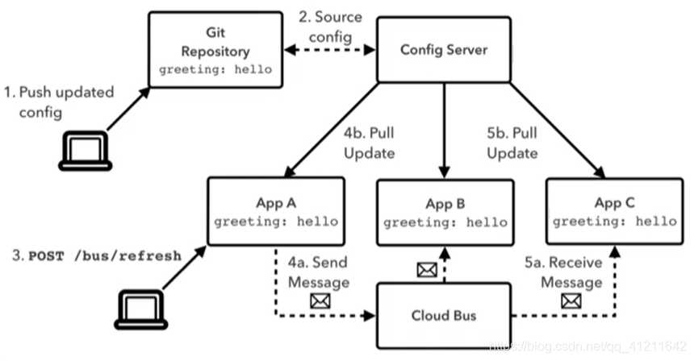
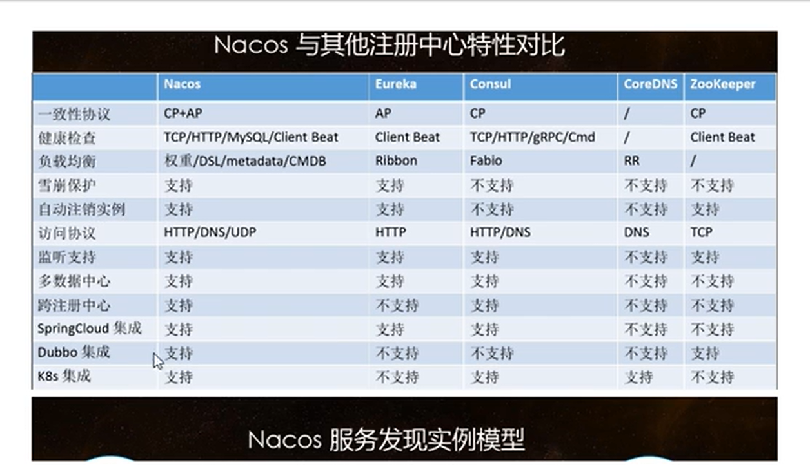

# Springcloud Go

0-4章零基础，5-9章初级，10-16章中级，17-21章高级(Springcloud Alibaba)

#### 概念
1. 基于分布式的微服务架构
   - 服务注册与发现
   - 服务调用
   - 服务熔断
   - 负载均衡
   - 服务降级
   - 服务消息队列
   - 配置中心管理
   - 服务网关
   - 服务监控
   - 全链路追踪
   - 自动化构建部署
   - 服务定时任务调度操作
2. SpringCloud微服务全家桶
   - 版本需对应：Hoxton.SR1：Spring Boot >= 2.2.0.M4 and < 2.2.5.BUILD-SNAPSHOT
   - 本次SpringCloudGo选定cloud Hoxton.SR1；boot 2.2.2.Release；cloud alibaba 2.1.0.Release
   - Cloud升级
     


#### 项目复现


##### 支付模块
1. Maven中DependencyManagement 和 Dependencies的区别
   
- DependencyManagement最顶层的父pom，子项目会继承DependencyManagement的项目指定的版本号：即父类父容器统一版本号
  
2. 业务类编写套路
   - 建表Sql，Sql语句比较重要
   例子
   ``` sql
   CREATE TABLE 'payment' (
      'id' bigint(20) NOT NULL AUTO_INCREMENT COMMENT 'ID',
      'serial' varchar(200) DEFAULT,
      PRIMARY KEY('id')
   ) ENGINE=InnoDB AUTO_INCREMENT=1 DEFAULT CHARSET=utf8
   ```
   - entities
   - dao
       - @Mapper和@Repository注解有差别，多用前一个
       - 一般都要做一个resultMap的关系集映射
   - service
       - @Service注解
       - 一般用@Autowired，还有个@Resource
   - controller

3. 自动热部署功能dev-tools

##### 消费者订单模块
1. RestTemplate
   - 提供了多种便捷访问远程Http服务的方法
   - 简单便捷的restful服务模板类，是Spring提供的用于访问Rest服务的客户端模板工具集
   - 如 80 ——> 8001的调用
   - (url, requestMap, ResponseBean.class) 分别代表Rest请求地址、请求参数、http响应转换被转换成的对象类型
   - ApplicationContextConfig需要将RestTemplate注入Springboot容器


##### Eureka

1. 
   - Eureka Server提供服务注册服务，心跳检测
   - Eureka Client通过注册中心进行访问

2. Euraka服务端安装
   - 单机
   - 集群：
       - 微服务RPC远程服务调用最核心观点：搭建Eureka注册中心集群，实现负载均衡+故障容错
       - 互相注册，相互守望
       - 需要修改映射配置添加进hosts文件
       - 消费者更改统一的微服务名称，使得url不写死
       - @LoadBalanced使得RestTemplate提供负载均衡的能力，需要在ApplicationContextConfig处配置。即轮询8001/8002交替出现

3. 服务发现Discovery：对于注册进eureka里面的微服务，可以通过服务发现来获得该服务的信息
   - @EnableDiscoveryClient

4. Eureka保护模式
   - Eureka Server会保护其服务注册表中的信息，不会删除服务注册表中的数据，不会立刻清理，会先保存
   - 
   - CAP里面的AP分支
   - `eureka.server.enable-self-preservation: false`：禁用eureka保护模式，会直接剔除

5. Eureka停更


##### Zookeeper服务注册与发现

1. 注册中心Zookeeper替代Eureka Server的功能
2. @EnableDiscoveryClient：该注解用于向使用consul或者zookeeper作为注册中心时注册服务
3. 建议zookeeper使用docker走
4. 成功之后微服务会入住zookeeper服务器
5. zookeeper的提供的微服务节点是临时的


##### Consul

1. 类似Zookeeper，注册中心Consul替代Eureka Server的功能
2. 简介
   - 官网：https://www.consul.io/intro/index.html
   - 一套开源的分布式服务发现和配置管理系统，Go语言开发
3. 作用
   - 服务发现、健康监测、KV存储、多数据中心、可视化Web界面
4. 使用：https://springcloud.cc/spring-cloud-consul.html
5. American用的比较多


##### 三个注册中心异同点

1. 真正关键还是写业务逻辑

2. | 组件名    | 语言 | CAP  | 服务健康检查 | 对外暴露接口 | Spring Cloud 集成 |
   | --------- | ---- | ---- | ------------ | ------------ | ----------------- |
   | Eureka    | Java | AP   | 可配支持     | HTTP         | 已集成            |
   | Consul    | Go   | CP   | 支持         | HTTP/DNS     | 已集成            |
   | Zookeeper | Java | CP   | 支持         | 客户端       | 已集成            |

3. 
   一般只实现两种
   
   - AP架构：违背了一致性C的要求，只满足可用性和分区容错
   - CP架构：违背了可用性A的要求，只满足一致性和分区容错


##### Ribbon

1. 一套客户端负载均衡的工具，提供客户端软件负载均衡算法和服务调用
2. 官网：https://github.com/Netflix/ribbon/wiki/Getting-Started

3. LB（负载均衡）
   - 将用户的请求平摊分配到多个服务上，从而达到系统的HA(高可用)，常见的负载均衡有软件Nginx、LVS、硬件F5等
   - 分为集中式LB和进程内LB
   - Ribbon本地负载均衡客户端 VS Nginx服务端负载均衡
       - Nginx是服务器负载均衡，客户端所有请求都会交给nginx，然后由nginx实现转发请求。即负载均衡是由服务端实现的 —— 集中式LB
       - Ribbon本地负载均衡，在调用微服务接口时候，会在注册中心上获取注册信息服务列表之后缓存到JVM本地，从而在本地实现RPC远程服务调用技术 —— 进程内LB

4. Ribbon软负载均衡的客户端组件，可以和其他所需请求的客户端结合使用。和eruka结合就是一个实例
   
   - 根据策略，从server取到的服务注册表中选择一个地址
   - Ribbon多种策略：轮询、随机、根据响应时间加权...
   - **即能干嘛**：负载均衡+RestTemplate调用

5. 负载均衡算法原理：
   - rest接口第几次请求数 % 服务器集群总数量 = 实际调用服务器位置下标，每次服务重启动后rest接口技术从1开始

6. 手写负载均衡算法
   - 原理：Java的**CAS** / CompareAndSet + **自旋锁**学习


##### OpenFeign

1. 官网：https://cloud.spring.io/spring-cloud-static/Hoxton.SR1/reference/htmlsingle/#spring-cloud-openfeign
2. Feign是一个声明式的Web服务客户端，让编写Web服务客户端变得非常容易，只需创建一个接口并在接口上添加注解即可实现微服务间的调用
3. 


4. 一般使用OpenFeign
   使用步骤：
   - 微服务调用接口+@FeignClient
   - 客户端服务接口根据@FeignClient所显示的微服务名称去调用，服务暴露对外提供的方法
5. OpenFeign超时控制
   - 默认Feign客户端只等待1秒钟，但是服务端处理需要超过1秒钟，导致Feign客户端不想等待了，直接返回报错
   - 为了避免以上情况，有时候需要设置Feign客户端的超时控制
6. OpenFeign日志打印功能
   - 可以对接口的调用情况进行监控和输出
   - 日志级别：NONE、BASIC、HEADERS、FULL


##### Hystrix

1. 扇出：多个微服务之间调用，微服务A调用微服务B和微服务C，微服务B和微服务C又调用其他的微服务。
2. 服务雪崩：级联故障
3. Hystrix是一个用于处理分布式系统的延迟和容错的开源库。在分布式系统里，许多依赖不可避免的会调用失败，比如超时、异常等，Hystrix能够保证在一个依赖出问题的情况下，不会导致整体服务失败，避免级联故障，已提高分布式系统的弹性。
   - 断路器
   - 当某个服务单元发生故障后，通过断路器的故障监控，向调用方返回一个符合预期的、可处理的备选响应(FallBack)
   - 熔断和断流
4. Hystrix作用：
   - 对延迟和故障进行保护和控制
   - 对复杂的分布式系统阻止级联故障
   - 回退，尽可能优雅地降级


5. Hystrix重要概念：
   - 服务降级：“服务器忙，请稍后再试”，不让客户端等待并立刻返回一个友好提示fallback
       - 出错（宕机或程序运行异常）
       - 超时
       - 服务熔断
       - 线程池 / 信号量打满
   - 服务熔断：类似保险丝到达最大服务访问后，直接拒绝访问，拉闸限电，然后服务降级的方法返回友好提示
   - 服务限流：秒杀高并发等操作，排队，一秒钟N个，有序进行

6. 服务降级fallback可以放在客户端或者服务端一般放在客户端

7. `@DefaultProperties(defaultFallback = "")`：1：N，除了个别重要核心业务有专属fallback，其他普通的由此统一跳转。避免代码膨胀，减少代码量

8. 目前客户端与服务端关系紧紧耦合，对客户端接口进行处理，把它调用的所有微服务方法进行降级，就可以解决耦合问题

9. Hystrix服务熔断
    - 熔断机制：服务的降级 ——> 进而熔断 ——> 恢复调用链路
    - 熔断机制注解是：@HystrixCommand
    - 

10. Hystrix图形化Dashboard搭建和监控测试


##### Gateway

1. 网关类似一层套上去的端口，挡住外来攻击。Web请求，通过一些匹配条件，定位到真正的服务节点。并在这个转发过程的前后，进行一些精细化控制。Predicate 就是我们的匹配条件，而filter，为无所不能的拦截器。有了这两个元素再加上目标uri，就可以实现一个具体的路由。
2. Gateway工作流程
   - 
   - 核心逻辑：路由转发 + 执行过滤器链

3. Gateway动态路由，之前通过Ribbon负载均衡，将请求分散。替换为Gateway后只暴露Gateway，客户端请求统一发到Gateway，Gateway进行8001/8002转发

4. Gateway的Predicate：
   - 可以带各种所需参数如：Cookie、Header、Host、Method、Query
   - 按照时间After、Before、Between
   - 即Predicate为了实现一组匹配规则，让请求找对应的Route进行处理

5. Gateway的Filter：
   - GatewayFilter和GlobalFilter

##### Config

1. Springcloud提供了ConfigServer来实现一套集中式的、动态的配置管理设施
2. Config Server配置服务器为各个不同微服务应用的所有环境提供了一个中心化的外部配置
3. 作用
   - 集中管理配置文件
   - 不同环境不同配置，分环境部署如dev/test/prod/beta/release
   - ...

4. yml文件
   - bootstrap.yml作为新的yml文件，是系统级的优先级更高
   - application.yml是用户级的资源配置项

##### Bus消息总线

1. Springcloud Bus配合Springcloud Config可以实现配置的动态刷新
   - 
   - Bus目前支持RabbitMQ和Kafka
   - Bus能管理和传播分布式系统间的消息，可用于广播状态更改、事件推送、微服务间的通信信道
2. 消息总线

3. 需要用到**RabbitMQ**

4. 设计思想
   - 利用消息总线触发一个服务器端点，而刷新所有客户端的配置
   - 一次修改，广播通知，处处生效


##### Stream

1. 若存在多种MQ，使用Cloud Stream，只需要和Stream交互就可以进行管理
2. Springcloud Stream是一个构建消息驱动微服务的框架
3. 目前只支持RabbitMQ、Kafka
   - 两个消息中间件的架构不同，RabbitMQ有exchange，Kafka有Topic和Partition分区
   - 由于各消息中间件构建的初衷不同，它们的实现细节上会有较大的差异性，通过定义绑定器作为中间层，完美的实现了应用程序与消息中间件细节之间的隔离。
   - 定义绑定器Binder作为中间层

4. Stream分组消费和持久化
   - Stream的消息分组


##### Sleuth

1. Springcloud Sleuth提供了一套完整的服务跟踪的解决方案
2. Sleuth负责收集整理，Zipkin负责展现
3. Sleuth搭建链路监控步骤


#### Springcloud Alibaba

1. 文档：https://github.com/alibaba/spring-cloud-alibaba/blob/master/README-zh.md
   官网：https://spring.io/projects/spring-cloud-alibaba#overview
2. 作用
   - 服务限流降级：默认支持Servlet、Feign、RestTemplate、Dubbo、RocketMQ限流降级功能的接入
   - 服务注册与发现
   - 分布式配置管理
   - 消息驱动能力
   - 阿里云对象存储
   - 分布式任务调度
   - 详情查看文档...

3. 常用产品
   - Sentinel：把流量作为切入点，从流量控制、熔断降级、系统负载保护等多个维度保护任务的稳定性
   - Nacos：一个更易于构建云原生应用的动态服务发现、配置管理和服务管理平台
   - Seata：一个易于使用的高性能微服务分布式事务解决方案
   - ......

##### Nacos

1. Nacos分别取Naming和Configuration的前两个字母，最后的s为service
2. - Nacos一个更易于构建云原生应用的动态服务发现、配置管理和服务管理平台
   - Nacos：Dynamic Naming and Configuration Service，注册中心 + 配置中心的组合
   - Nacos = Eureka + Config + Bus。即可以替代Eureka做服务注册中心，替代Config做服务配置中心

3. 
4. Nacos支持AP 和 CP模式的转换
   - C是所有节点在同一时间看到的数据是一致的，A是所有请求都会得到相应

5. 示例
   - Nacos作为服务注册中心
   - Nacos作为服务配置中心
       - 分类配置：Namespace + Group + Data ID三者关系。最外层的Namespace是可以用于区分部署环境的，Group和Data ID逻辑上区分两个目标对象
       - 默认情况：Namespace=public，Group=DEFAULT_GROUP，Cluster是DEFAULT
       - Nacos默认Namespace是public，Namespace主要用来实现隔离。比方现在有三个环境：开发、测试、生产环境，可以创建三个Namespace，不同的Namespace之间是隔离的
       - Group默认是DEFAULT_GROUP，Group可以把不同的微服务划分到同一个分组里面去
       - Service就是微服务，一个Service可以包含多个Cluster（集群），Nacos默认Cluster是DEFAULT，Cluster是对指定微服务的一个虚拟划分比方说为了容灾，将Service微服务分别部署在了杭州机房和广州机房，这时就可以给杭州机房的Service微服务起一个集群名称（HZ）给广州机房的Service微服务起一个集群名称（GZ），还可以尽量让同一个机房的微服务互相调用，以提升性能
       - Instance就是微服务的实例
   - Nacos集群和持久化


##### Sentinel

1. Sentinel代替了Hystrix
2. Sentinel分为两个部分
   - 核心库（Java客户端）不依赖任何框架/库，能够运行于所有Java环境，同时对Dubbo/Spring Cloud等框架也有较好的支持
   - 控制台（Dashboard）基于Springboot开发，打包后直接运行，不需额外的Tomcat等应用容器

3. Sentinel流控
4. Sentinel降级
5. Sentinel服务熔断

##### Seata

1. 分布式问题：单体应用被拆分成微服务应用，原来的三个模块被拆分成三个独立的应用，分别使用三个独立的数据源，业务操作需要调用三个服务来完成。此时每个服务内部的数据一致性由本地事务来保证，但是全局的数据一致性没法保证。
2. Seata是一款开源的分布式事务解决方案，致力于在微服务架构下提供高性能和简单易用的分布式事务框架

3. | **Transaction ID XID**      | **全局唯一的事务ID**                                         |
   | --------------------------- | ------------------------------------------------------------ |
   | Transaction Coordinator(TC) | 事务协调器，维护全局事务的运行状态，负责协调并驱动事务的提交或回滚 |
   | Transaction Manager(TM)     | 控制全局事务的边界，负责开启一个全局事务，并最终发起全局提交或全局回滚的决议 |
   | Resource Manager(RM)        | 控制分支事务，负责分支注册、状态汇报，并接收事务协调器的指令，驱动分支(本地)事务的提交或回滚 |

4. Seata分布式交易解决方案，官网：https://seata.io/zh-cn/


#### 总结

1. 只是在源码级别上了解微服务框架技术
2. 以Alibaba为核心使用，使用时还是得另看/(ㄒoㄒ)/~~
3. 得结合项目，实用性不高...